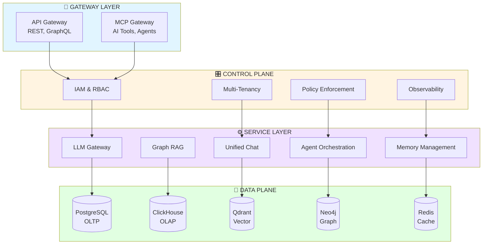
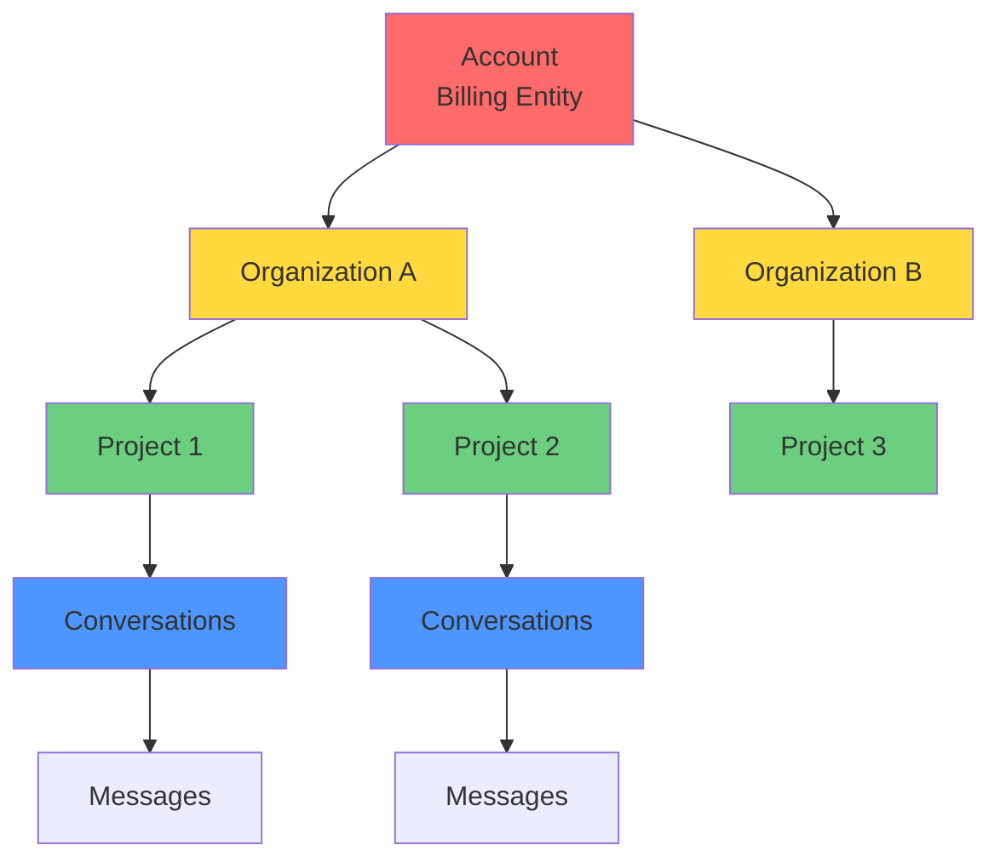
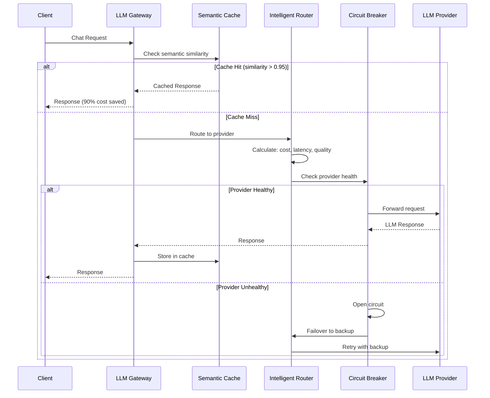
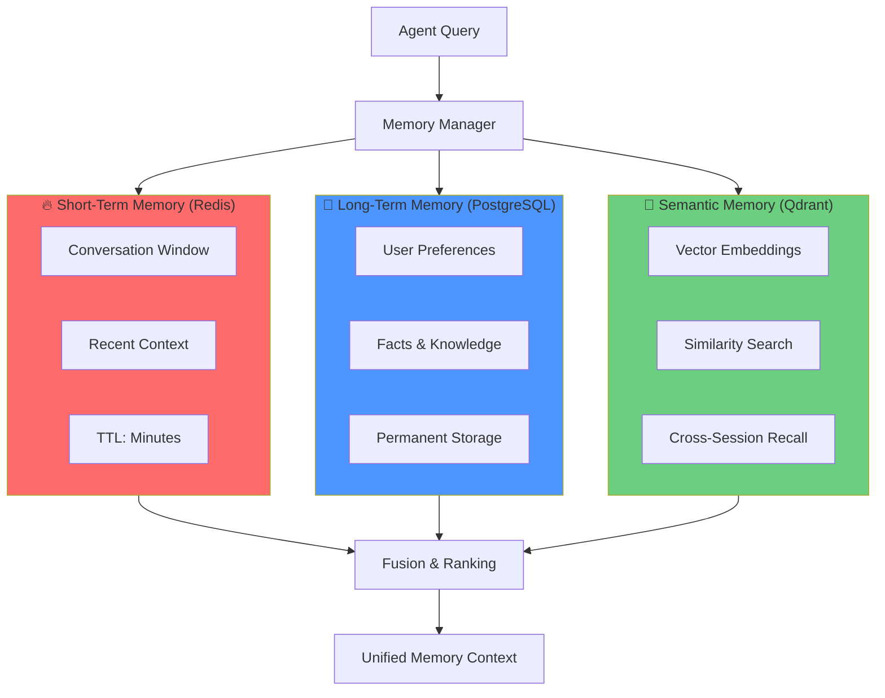
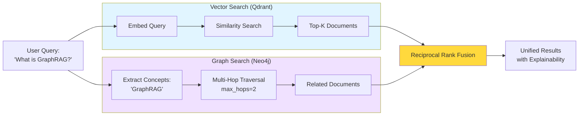
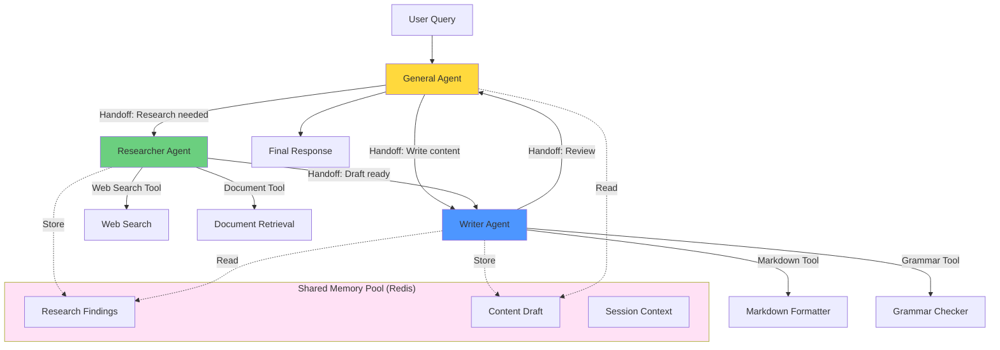
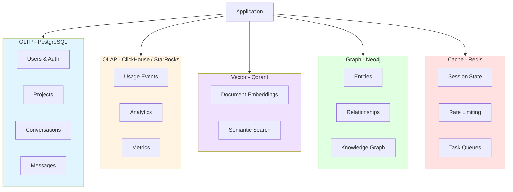
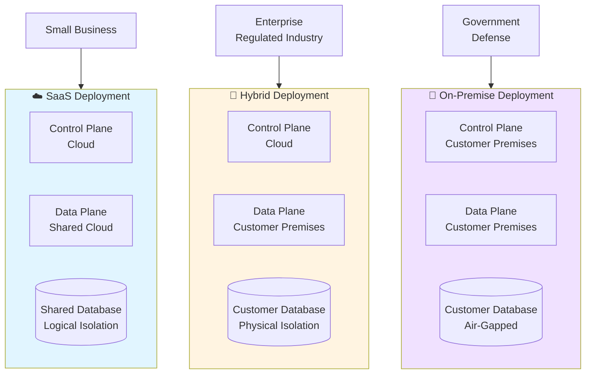
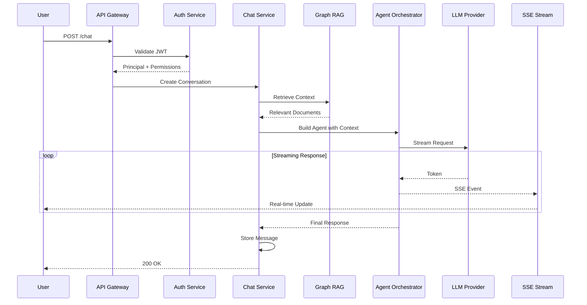
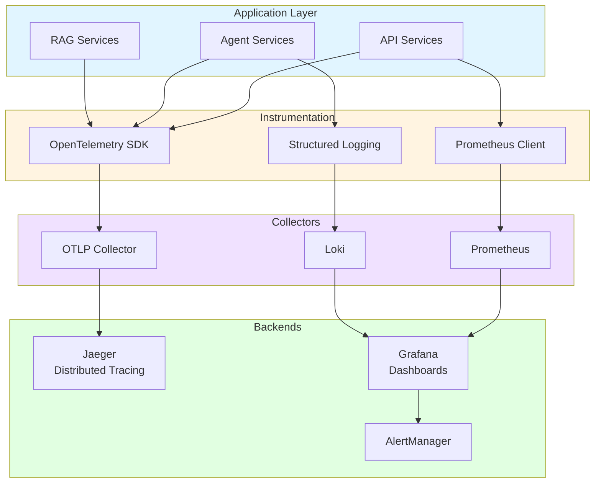

# Architecture Diagrams for Presentations

This document contains Mermaid diagrams that can be rendered in presentations. Use tools like:
- **Mermaid Live Editor**: https://mermaid.live
- **VS Code Extension**: Markdown Preview Mermaid Support
- **Export**: PNG/SVG for PowerPoint/Keynote

---

## 1. 4-Layer Architecture Overview



---

## 2. Multi-Tenancy Hierarchy



---

## 3. LLM Gateway Request Flow



---

## 4. Memory Management - 3-Layer System



---

## 5. Graph RAG - Hybrid Retrieval



---

## 6. Multi-Agent Swarm Coordination



---

## 7. Data Plane - Storage Selection



---

## 8. Deployment Models Comparison



---

## 9. Chat Request End-to-End Flow



---

## 10. Observability Stack



---

## Usage Instructions

### Converting to Images

**Option 1: Mermaid Live Editor**
1. Copy diagram code
2. Go to https://mermaid.live
3. Paste code
4. Export as PNG or SVG

**Option 2: VS Code**
1. Install "Markdown Preview Mermaid Support" extension
2. Open this file
3. Preview with Cmd+Shift+V (Mac) or Ctrl+Shift+V (Windows)
4. Right-click diagram → Copy as PNG

**Option 3: CLI Tool**
```bash
npm install -g @mermaid-js/mermaid-cli
mmdc -i diagrams.md -o diagrams.png
```

### Customizing Diagrams

- **Colors**: Change `fill:#RRGGBB` in `style` directives
- **Layout**: Adjust `TB` (top-bottom), `LR` (left-right), `RL`, `BT`
- **Node Shapes**:
  - `[]` Rectangle
  - `()` Rounded
  - `[()]` Stadium
  - `{}` Diamond
  - `[()]` Cylinder (database)

---

## Diagram Best Practices for Presentations

1. **High Contrast**: Use dark text on light backgrounds
2. **Large Fonts**: Increase default font size for projector readability
3. **Limited Colors**: Stick to 4-5 colors max per diagram
4. **Progressive Disclosure**: Show diagrams step-by-step (use animation)
5. **Annotations**: Add callouts for key points in presentation software
6. **Consistency**: Use same color scheme across all diagrams
7. **Simplicity**: Remove unnecessary details for executive presentations

---

**Next**: Import these diagrams into your presentation deck and add speaker notes.
