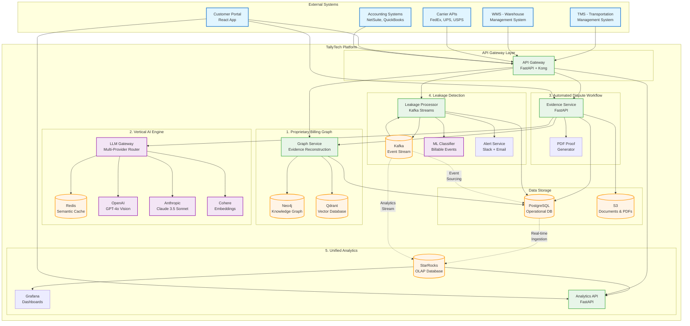
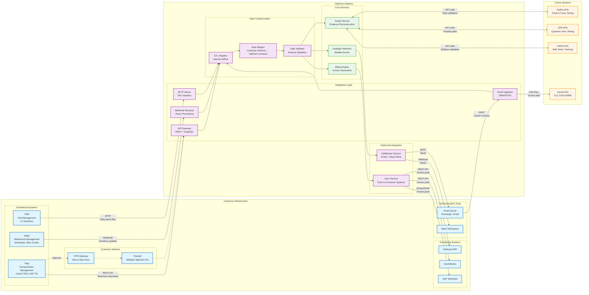
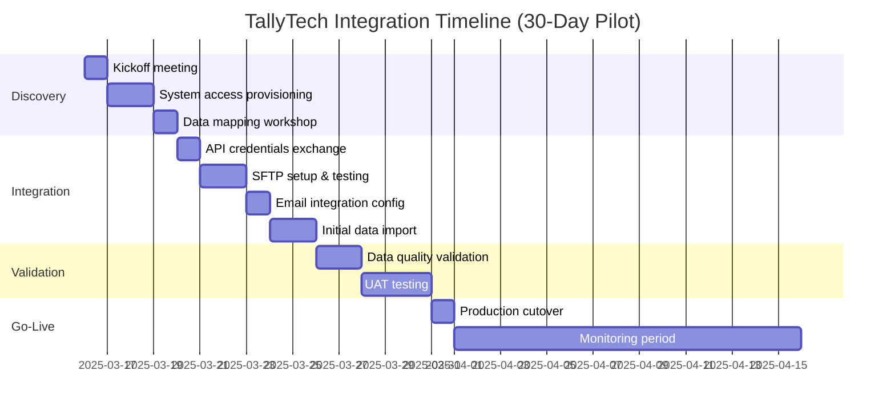

# TallyTech Architecture Diagrams

**Document Purpose**: Visual architecture diagrams showing TallyTech's system design, deployment topology, and integration patterns.

**Last Updated**: 2025-03-16

---

## Table of Contents

1. [System Architecture (High-Level Components)](#1-system-architecture-high-level-components)
2. [Deployment Architecture (Infrastructure)](#2-deployment-architecture-infrastructure)
3. [Integration Architecture (Customer Systems)](#3-integration-architecture-customer-systems)

---

## 1. System Architecture (High-Level Components)

### Overview

TallyTech's platform consists of 5 major subsystems:
1. **Proprietary Billing Graph** - Evidence reconstruction engine (Neo4j + Qdrant)
2. **Vertical AI Engine** - LLM Gateway with semantic caching
3. **Automated Dispute Workflow** - Evidence Service + Customer Portal
4. **Leakage Detection** - Event-driven revenue capture (Kafka)
5. **Unified Analytics** - Real-time dashboards (StarRocks + Grafana)

### Mermaid Diagram



### Component Descriptions

| Component | Technology | Purpose | Performance Target |
|-----------|-----------|---------|-------------------|
| **API Gateway** | FastAPI + Kong | Request routing, auth, rate limiting | <50ms overhead |
| **Neo4j** | Graph Database | Evidence chain storage & traversal | <100ms p95 queries |
| **Qdrant** | Vector Database | Semantic similarity search for disputes | <50ms vector search |
| **LLM Gateway** | FastAPI | Multi-provider LLM routing with caching | 85%+ cache hit rate |
| **Redis** | In-Memory Cache | Semantic cache for LLM responses | <10ms cache reads |
| **Kafka** | Event Stream | Real-time billable event processing | <5s end-to-end latency |
| **StarRocks** | OLAP Database | Real-time analytics & dashboards | <1s query response |
| **PostgreSQL** | Relational DB | Operational data (invoices, disputes) | <100ms OLTP queries |
| **S3** | Object Storage | PDF documents, evidence files | 99.99% durability |

---

## 2. Deployment Architecture (Infrastructure)

### Overview

TallyTech deploys on AWS using Kubernetes (EKS) for orchestration, with multi-region support for high availability.

### Mermaid Diagram



```mermaid
graph TB
    subgraph "AWS Cloud - us-east-1 (Primary Region)"
        subgraph "VPC - 10.0.0.0/16"
            subgraph "Public Subnet - 10.0.1.0/24"
                ALB[Application Load Balancer<br/>AWS ALB]
                NAT[NAT Gateway]
            end

            subgraph "Private Subnet - 10.0.10.0/24"
                subgraph "EKS Cluster - TallyTech Production"
                    subgraph "API Services (Deployments)"
                        APIGateway[API Gateway<br/>3 replicas]
                        GraphSvc[Graph Service<br/>5 replicas]
                        EvidenceSvc[Evidence Service<br/>5 replicas]
                        LeakageSvc[Leakage Service<br/>3 replicas]
                        AnalyticsSvc[Analytics API<br/>3 replicas]
                    end

                    subgraph "Worker Services (Deployments)"
                        LLMGateway[LLM Gateway<br/>5 replicas]
                        MLWorker[ML Classifier<br/>3 replicas]
                        IngestWorker[Data Ingestion<br/>2 replicas]
                    end

                    subgraph "Ingress"
                        NginxIngress[NGINX Ingress<br/>Controller]
                    end
                end
            end

            subgraph "Data Subnet - 10.0.20.0/24"
                subgraph "Stateful Services (StatefulSets)"
                    Neo4jCluster[Neo4j Cluster<br/>3 nodes]
                    KafkaCluster[Kafka Cluster<br/>3 brokers]
                    RedisCluster[Redis Cluster<br/>3 nodes]
                end

                subgraph "Managed Databases (RDS)"
                    RDSPrimary[(PostgreSQL<br/>Primary - db.r5.4xlarge)]
                    RDSReplica1[(PostgreSQL<br/>Read Replica 1)]
                    RDSReplica2[(PostgreSQL<br/>Read Replica 2)]
                end

                subgraph "OLAP Database"
                    StarRocksFE[StarRocks FE<br/>3 nodes]
                    StarRocksBE[StarRocks BE<br/>6 nodes]
                end
            end

            subgraph "Vector DB Subnet - 10.0.30.0/24"
                QdrantCluster[Qdrant Cluster<br/>3 nodes]
            end
        end

        subgraph "AWS Managed Services"
            S3Bucket[(S3 Bucket<br/>tallytech-documents)]
            CloudWatch[CloudWatch<br/>Logs + Metrics]
            SecretsMgr[AWS Secrets Manager<br/>API Keys & Credentials]
        end
    end

    subgraph "AWS Cloud - us-west-2 (DR Region)"
        subgraph "VPC - 10.1.0.0/16"
            DREK8s[EKS Cluster<br/>Standby]
            DRRDS[(PostgreSQL<br/>Cross-Region Replica)]
            DRS3[(S3 Bucket<br/>Cross-Region Replication)]
        end
    end

    subgraph "External Services"
        OpenAIAPI[OpenAI API<br/>api.openai.com]
        AnthropicAPI[Anthropic API<br/>api.anthropic.com]
        CohereAPI[Cohere API<br/>api.cohere.ai]
        Datadog[Datadog APM<br/>Monitoring]
        PagerDuty[PagerDuty<br/>Alerting]
    end

    %% Internet to ALB
    Internet((Internet)) --> ALB

    %% ALB to Ingress
    ALB --> NginxIngress

    %% Ingress to Services
    NginxIngress --> APIGateway
    NginxIngress --> GraphSvc
    NginxIngress --> EvidenceSvc
    NginxIngress --> AnalyticsSvc

    %% Services to Databases
    GraphSvc --> Neo4jCluster
    GraphSvc --> QdrantCluster
    GraphSvc --> RDSPrimary
    EvidenceSvc --> RDSPrimary
    EvidenceSvc --> S3Bucket
    LeakageSvc --> KafkaCluster
    LeakageSvc --> RDSPrimary
    AnalyticsSvc --> StarRocksBE

    %% LLM Gateway to External APIs
    LLMGateway --> OpenAIAPI
    LLMGateway --> AnthropicAPI
    LLMGateway --> CohereAPI
    LLMGateway --> RedisCluster

    %% Database Replication
    RDSPrimary -.->|Async<br/>Replication| RDSReplica1
    RDSPrimary -.->|Async<br/>Replication| RDSReplica2
    RDSPrimary -.->|Cross-Region<br/>Replication| DRRDS
    S3Bucket -.->|Cross-Region<br/>Replication| DRS3

    %% Monitoring
    APIGateway -.-> CloudWatch
    GraphSvc -.-> CloudWatch
    EvidenceSvc -.-> CloudWatch
    CloudWatch -.-> Datadog
    Datadog -.-> PagerDuty

    %% Secrets
    APIGateway -.-> SecretsMgr
    LLMGateway -.-> SecretsMgr

    %% NAT for private subnet internet access
    GraphSvc -.->|Outbound| NAT
    LLMGateway -.->|Outbound| NAT

    classDef lb fill:#ff6b6b,stroke:#c92a2a,stroke-width:2px,color:#fff
    classDef k8s fill:#326ce5,stroke:#1a4d9e,stroke-width:2px,color:#fff
    classDef db fill:#ffd43b,stroke:#f59f00,stroke-width:2px
    classDef external fill:#e1f5ff,stroke:#0066cc,stroke-width:2px
    classDef monitoring fill:#51cf66,stroke:#2f9e44,stroke-width:2px

    class ALB,NginxIngress lb
    class APIGateway,GraphSvc,EvidenceSvc,LeakageSvc,AnalyticsSvc,LLMGateway,MLWorker k8s
    class RDSPrimary,RDSReplica1,RDSReplica2,DRRDS,Neo4jCluster,KafkaCluster,RedisCluster,StarRocksFE,StarRocksBE,QdrantCluster db
    class OpenAIAPI,AnthropicAPI,CohereAPI external
    class CloudWatch,Datadog,PagerDuty monitoring
```

### Infrastructure Specifications

#### Kubernetes Cluster (EKS)
```yaml
Cluster: TallyTech-Production
Region: us-east-1
Version: 1.28

Node Groups:
  - Name: api-services
    Instance Type: c5.2xlarge (8 vCPU, 16 GB RAM)
    Min Size: 3
    Max Size: 20
    Auto-scaling: Enabled (CPU > 70%)

  - Name: worker-services
    Instance Type: c5.4xlarge (16 vCPU, 32 GB RAM)
    Min Size: 3
    Max Size: 15
    Auto-scaling: Enabled (CPU > 70%)

  - Name: stateful-services
    Instance Type: r5.4xlarge (16 vCPU, 128 GB RAM)
    Min Size: 3
    Max Size: 6
    EBS Volumes: 500 GB gp3 per node
```

#### Database Sizing

| Database | Instance Type | Storage | IOPS | Replication |
|----------|--------------|---------|------|-------------|
| **PostgreSQL (RDS)** | db.r5.4xlarge | 2 TB gp3 | 12,000 | Multi-AZ + 2 read replicas |
| **Neo4j** | r5.4xlarge × 3 | 1 TB EBS per node | 10,000 | 3-node cluster (HA) |
| **StarRocks BE** | r5.4xlarge × 6 | 2 TB EBS per node | 10,000 | 3x replication |
| **Redis** | r5.2xlarge × 3 | In-memory only | N/A | Cluster mode (sharded) |
| **Kafka** | c5.2xlarge × 3 | 500 GB EBS per broker | 5,000 | 3-broker cluster |
| **Qdrant** | r5.2xlarge × 3 | 500 GB EBS per node | 5,000 | 3-node cluster |

#### Cost Estimate (Monthly)

```
Compute (EKS Nodes):        $8,500
RDS PostgreSQL:             $2,800
Neo4j Cluster:              $3,600
StarRocks Cluster:          $5,400
Kafka Cluster:              $1,800
Redis Cluster:              $1,200
Qdrant Cluster:             $1,200
S3 Storage (10 TB):         $230
Data Transfer:              $500
CloudWatch:                 $300
Secrets Manager:            $50
NAT Gateway:                $150
──────────────────────────────────
Total Monthly:              ~$25,730

At 100 customers:
Cost per customer:          $257/month
Platform fee:               $4,167/month ($50K annual)
Gross margin:               94%
```

---

## 3. Integration Architecture (Customer Systems)

### Overview

TallyTech integrates with customer's existing logistics and accounting systems to ingest shipment data, carrier invoices, and push billing updates.

### Mermaid Diagram



### Integration Methods

#### 1. Real-Time Integrations (REST API)

**Customer → TallyTech (Inbound)**
```yaml
Method: POST /api/v1/shipments
Authentication: API Key + JWT
Format: JSON
Frequency: Real-time (on shipment creation)

Example Payload:
{
  "customer_id": "CUST-001",
  "tracking_number": "TRK-123456",
  "service_type": "ground_residential",
  "origin": {
    "address": "123 Warehouse St, City, State, ZIP",
    "lat": 40.7589,
    "lon": -73.9851
  },
  "destination": {
    "address": "456 Customer Ave, City, State, ZIP",
    "address_type": "residential"
  },
  "package": {
    "weight_lbs": 15.5,
    "dimensions": {"length": 12, "width": 10, "height": 8}
  },
  "carrier": "FedEx",
  "service_level": "Ground",
  "shipment_date": "2025-03-16T10:30:00Z"
}
```

**TallyTech → Customer (Outbound)**
```yaml
Method: POST /api/invoices
Authentication: OAuth 2.0 (NetSuite, QuickBooks)
Format: JSON
Frequency: Daily batch (or real-time on invoice approval)

Example Payload (NetSuite):
{
  "customer_id": "CUST-001",
  "invoice_id": "INV-2025-03-001",
  "invoice_date": "2025-03-16",
  "due_date": "2025-04-15",
  "line_items": [
    {
      "description": "Ground Residential Delivery",
      "quantity": 1,
      "unit_price": 12.50,
      "amount": 12.50,
      "evidence_url": "https://app.tallytech.com/evidence/evt-123"
    },
    {
      "description": "Residential Surcharge",
      "quantity": 1,
      "unit_price": 4.75,
      "amount": 4.75,
      "evidence_url": "https://app.tallytech.com/evidence/evt-124"
    }
  ],
  "total_amount": 17.25,
  "currency": "USD"
}
```

#### 2. Batch Integrations (SFTP)

**File Transfer Schedule**
```yaml
Direction: Customer → TallyTech
Protocol: SFTP (SSH File Transfer Protocol)
Schedule: Daily @ 2:00 AM customer timezone
Location: /inbound/shipments/YYYYMMDD/

File Format: CSV or XML
Retention: 90 days on SFTP server

Example CSV (shipments.csv):
tracking_number,service_type,origin_address,dest_address,weight_lbs,shipment_date
TRK-001,ground,123 Main St City ST 12345,456 Oak Ave City ST 67890,15.5,2025-03-16
TRK-002,overnight,789 Industrial Blvd City ST 13579,321 Residential Ln City ST 24680,3.2,2025-03-16
```

#### 3. Email Integrations (Carrier Invoices)

**Email Ingestion Process**
```yaml
Protocol: IMAP (Gmail, Exchange)
Polling Frequency: Every 5 minutes
Inbox: billing@customer.com

Supported Formats:
  - PDF attachments (OCR with GPT-4o Vision)
  - EDI X12 210 (Invoice)
  - EDI X12 990 (Response to Load Tender)
  - CSV/Excel attachments

Processing:
  1. Download email attachments
  2. Extract invoice data (LLM + OCR)
  3. Validate against carrier rate schedules
  4. Match to existing shipments (tracking number lookup)
  5. Flag discrepancies (leakage detection)
  6. Auto-add missing charges to customer invoice
```

#### 4. Webhook Integrations (Event-Driven)

**Carrier Webhooks (FedEx, UPS)**
```yaml
Endpoint: POST /api/v1/webhooks/carrier/tracking
Authentication: HMAC signature validation

Event Types:
  - shipment.delivered
  - shipment.exception (delivery failure)
  - shipment.in_transit
  - shipment.address_corrected

Example Webhook Payload (FedEx):
{
  "event_type": "shipment.delivered",
  "tracking_number": "TRK-123456",
  "status": "Delivered",
  "delivery_timestamp": "2025-03-16T14:22:00Z",
  "delivery_location": {
    "latitude": 40.7589,
    "longitude": -73.9851
  },
  "signature": "John Doe",
  "photo_url": "https://fedex.com/proof/123456.jpg"
}
```

### Security & Compliance

#### Authentication Methods

| System | Method | Notes |
|--------|--------|-------|
| **REST API** | API Key + JWT | Rotating API keys every 90 days |
| **SFTP** | SSH Keys | Public key authentication, no passwords |
| **Email** | OAuth 2.0 | Gmail/Exchange OAuth tokens |
| **Webhooks** | HMAC Signature | SHA-256 signature validation |
| **NetSuite/QuickBooks** | OAuth 2.0 | Refresh tokens, scoped permissions |

#### Network Security

```yaml
Firewall Rules:
  - TallyTech IPs whitelisted (static IP ranges)
  - Mutual TLS for API connections
  - VPN tunnel for sensitive customers (optional)

Data Encryption:
  - In Transit: TLS 1.3
  - At Rest: AES-256 encryption
  - Database: Transparent Data Encryption (TDE)

Compliance:
  - SOC 2 Type 2 (in progress)
  - GDPR compliant (EU data residency option)
  - CCPA compliant (data deletion workflows)
```

### Integration Timeline

**Typical Customer Onboarding (30-Day Pilot)**



---

## Summary

### Key Architectural Decisions

1. **Microservices Architecture** - Independent scaling of Graph, AI, Dispute, Leakage, Analytics services
2. **Event-Driven Design** - Kafka for real-time leakage detection and async processing
3. **Multi-Provider LLM Strategy** - Avoid vendor lock-in, optimize cost/performance per task
4. **Semantic Caching** - 90% cost reduction through intelligent caching layer
5. **Hybrid Cloud** - AWS primary with multi-region DR, flexibility for customer data residency requirements
6. **API-First Integrations** - Modern REST/GraphQL APIs with legacy SFTP/EDI support

### Scalability Targets

| Metric | Current (5 Customers) | 12-Month Goal (50 Customers) | 24-Month Goal (200 Customers) |
|--------|---------------------|----------------------------|------------------------------|
| **Invoices/month** | 50,000 | 500,000 | 2,000,000 |
| **Graph queries** | 500 QPS | 5,000 QPS | 20,000 QPS |
| **LLM calls/day** | 10,000 | 100,000 | 400,000 |
| **Kafka events/sec** | 100 | 1,000 | 4,000 |
| **StarRocks queries** | 50 QPS | 500 QPS | 2,000 QPS |
| **Infrastructure cost** | $5K/month | $35K/month | $100K/month |
| **Cost per customer** | $1,000/month | $700/month | $500/month |

### High Availability SLAs

- **Uptime**: 99.9% (< 44 minutes downtime/month)
- **API Response Time**: <100ms p95
- **Evidence Generation**: <2 seconds p95
- **Dispute Resolution**: <5 seconds p95
- **Data Freshness**: <5 minutes (real-time analytics)
- **Disaster Recovery**: RPO 1 hour, RTO 4 hours

---

**Document Version**: 1.0
**Author**: CTO Candidate for TallyTech
**Next Steps**: Review architecture diagrams before interview, prepare to discuss scalability strategy and infrastructure costs

