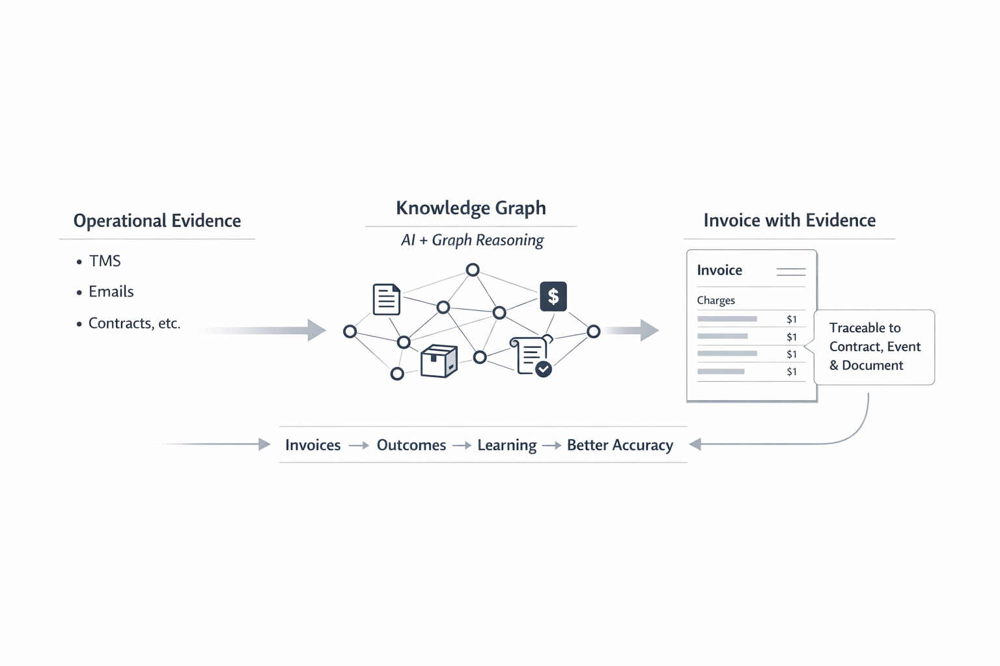
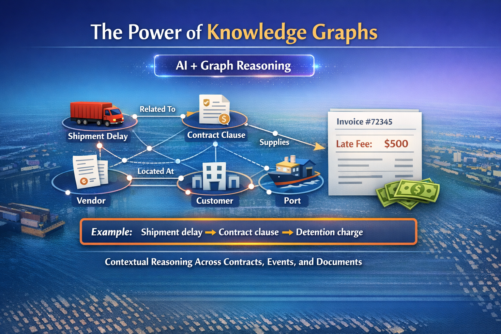
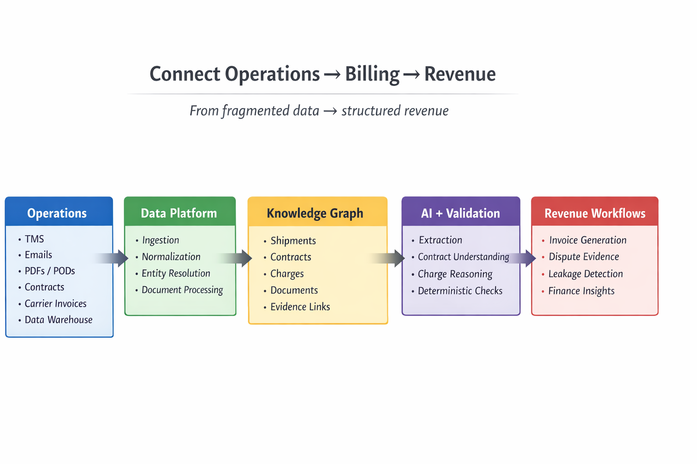
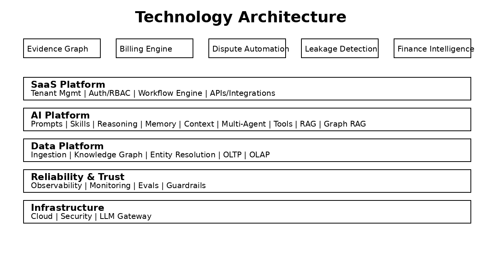
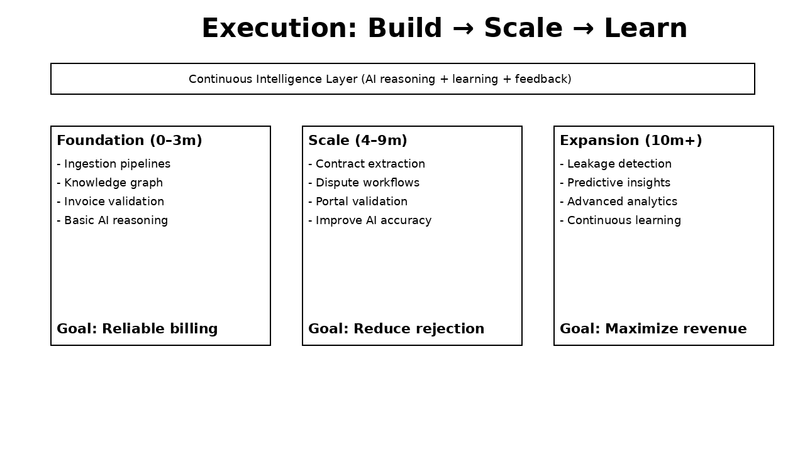
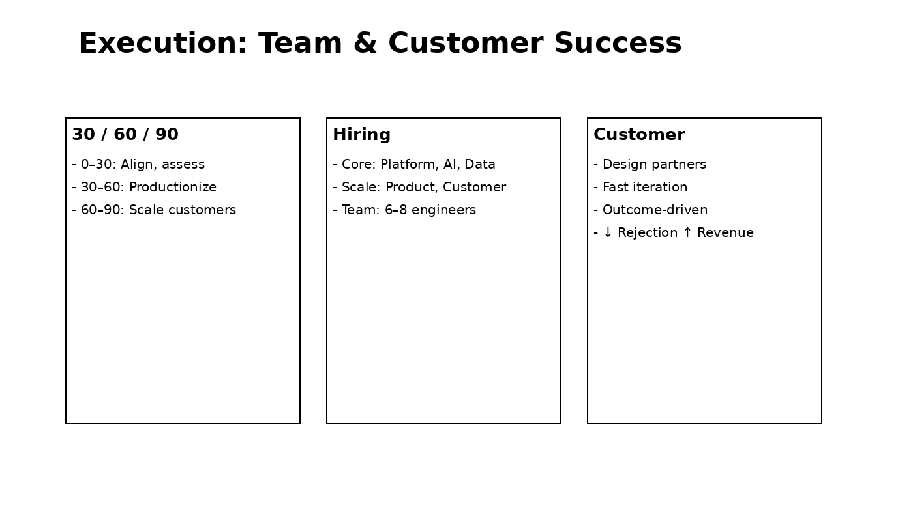

# TallyGo

## AI Revenue Automation Platform for Logistics

**Solving 10%+ Revenue Leakage Through Vertical AI + Knowledge Graphs**

March 16, 2025

---

## Today's Roadmap

**1. The Problem**
   Revenue loss in fragmented operations

**2. The Solution**
   Proprietary Billing Graph + Vertical AI

**3. The Platform**
   Event-driven architecture at scale

**4. Execution**
   30-Day Pilot → $2M ARR

---

# 1️⃣ The Problem

## Revenue Loss Starts in Operations

---

### Fragmented Operations

- 🗄️ **TMS**
- 📧 **Emails**
- 📄 **PDFs / PODs**
- 📋 **Contracts**
- 💰 **Carrier invoices**
- 🔗 **AP portals**

→

### Business Impact

- 🚫 **Invoice rejections**
- 💸 **Missed charges**
- ✅ **Manual reconciliation**
- ⏰ **Slow collections**

Billing fails when operational evidence is disconnected

---

## The Opportunity

**Mid-size 3PL (Industry Benchmark)**:

- 📊 **Invoice rejection rate**: 50%
- 💰 **Revenue leakage**: 10%+ ($1M annually)
- ⏱️ **Days Sales Outstanding**: 100+ days
- 👥 **Manual billing effort**: 200 hours/month

---

# 2️⃣ The Solution

---

## Knowledge Graph: AI + Graph Reasoning

---

## Example: Detention Charge Detection

---

## Vertical AI Advantage

❌

<h3 style="text-align: center; color: #dc2626; font-size: 32px; margin-top: 0; border: none; padding: 0;">Generic AI</h3>

📊 <strong>Accuracy</strong>: 80-85%

💰 <strong>Cost</strong>: $0.03/invoice

📚 <strong>Training</strong>: General internet

❌ Not audit-grade

✅

<h3 style="text-align: center; color: #16a34a; font-size: 32px; margin-top: 0; border: none; padding: 0;">TallyGo AI</h3>

📊 <strong>Accuracy</strong>: 95%+

💰 <strong>Cost</strong>: $0.003/invoice

📚 <strong>Training</strong>: 10K+ logistics invoices

✅ Audit-grade precision

10-15% accuracy lift = CFO trust | 90% cost reduction | 18-24 months to replicate

---

# 3️⃣ The Platform

---

## Connect Operations → Billing → Revenue

---

## Technology Architecture

---

# 4️⃣ Execution

---

## Build → Scale → Learn

---

## Team & Customer Success

